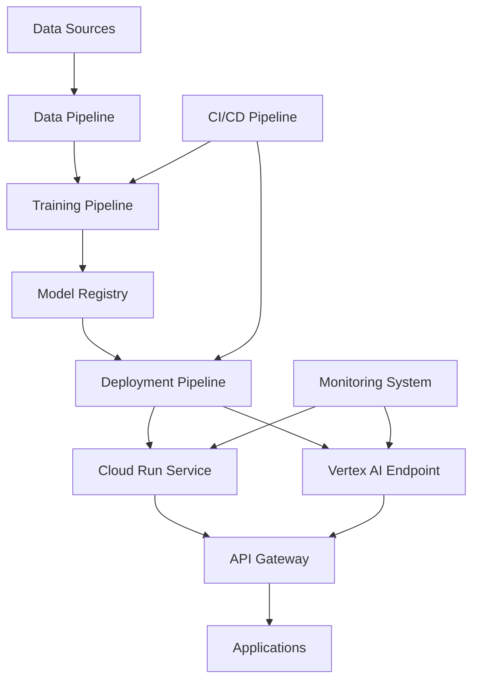

# LLM MLOps Project: Chat Completion Model

[](https://github.com/your-org/llm-mlops-project/actions)
[](https://github.com/your-org/llm-mlops-project/actions)
[](https://opensource.org/licenses/MIT)

## 🎯 Project Overview

This project implements a comprehensive MLOps (Machine Learning Operations) pipeline for developing, training, and deploying a custom Large Language Model (LLM) specifically designed for chat completion tasks. The architecture emphasizes automation, version control, scalability, and reliability across the entire ML lifecycle.

### Key Features

- **🤖 Custom LLM Architecture**: Transformer-based model built from scratch for chat completion
- **🔄 End-to-End MLOps**: Automated pipelines for training, validation, and deployment
- **☁️ Cloud-Native**: Built for Google Cloud Platform with Vertex AI integration
- **📊 Comprehensive Monitoring**: Real-time performance tracking and observability
- **🚀 Scalable Deployment**: Support for Cloud Run and Vertex AI endpoints
- **🛡️ Production-Ready**: Includes testing, security, and reliability best practices

## 🏗️ Architecture



### Components

1. **Data Pipeline**: Preprocessing, tokenization, and validation
2. **Training Pipeline**: Distributed training on Vertex AI with experiment tracking
3. **Model Registry**: Versioned model artifacts in Vertex AI Model Registry
4. **Deployment Pipeline**: Automated deployment to Cloud Run and Vertex AI
5. **Monitoring System**: Performance metrics, logging, and alerting
6. **CI/CD Pipeline**: Automated testing, building, and deployment

## 📁 Project Structure

```
llm-mlops-project/
├── .github/
│   ├── workflows/                 # GitHub Actions workflows
│   │   ├── ci-cd.yml             # Main CI/CD pipeline
│   │   ├── model-training.yml    # Model training workflow
│   │   └── monitoring.yml        # Monitoring and alerts
│   └── copilot-instructions.md   # GitHub Copilot instructions
├── src/
│   ├── models/                   # Model architectures
│   │   └── chat_completion_model.py
│   ├── data/                     # Data processing
│   │   └── preprocessing.py
│   ├── training/                 # Training scripts
│   │   └── train.py
│   ├── inference/                # Inference API
│   │   └── api.py
│   └── utils/                    # Utilities
│       ├── gcs_utils.py
│       ├── monitoring.py
│       └── logging_utils.py
├── pipelines/                    # ML pipelines
│   ├── training/
│   └── deployment/
├── deployment/                   # Deployment configurations
│   ├── cloud_run/
│   │   ├── service.yaml
│   │   └── deploy.sh
│   └── vertex_ai/
│       └── deploy.py
├── configs/                      # Configuration files
│   └── config.yaml
├── data/                         # Data storage
│   ├── raw/
│   ├── processed/
│   └── schemas/
├── tests/                        # Test suites
│   ├── unit/
│   └── integration/
├── docs/                         # Documentation
├── scripts/                      # Utility scripts
├── requirements.txt              # Python dependencies
├── Dockerfile                    # Container configuration
├── docker-compose.yml           # Local development
└── README.md                    # This file
```

## 🚀 Quick Start

### Prerequisites

- Python 3.11+
- Docker
- Google Cloud SDK
- Git

### 1. Environment Setup

```bash
# Clone the repository
git clone https://github.com/your-org/llm-mlops-project.git
cd llm-mlops-project

# Create virtual environment
python -m venv venv
source venv/bin/activate  # On Windows: venv\Scripts\activate

# Install dependencies
pip install -r requirements.txt

# Setup pre-commit hooks
pre-commit install
```

### 2. Configuration

```bash
# Copy environment template
cp .env.template .env

# Edit .env file with your configuration
# - GCP_PROJECT_ID: Your Google Cloud project ID
# - GCS_BUCKET_NAME: Your Cloud Storage bucket
# - GOOGLE_APPLICATION_CREDENTIALS: Path to service account key
```

### 3. Google Cloud Setup

```bash
# Authenticate with Google Cloud
gcloud auth login
gcloud config set project YOUR_PROJECT_ID

# Enable required APIs
gcloud services enable aiplatform.googleapis.com
gcloud services enable cloudbuild.googleapis.com
gcloud services enable run.googleapis.com
gcloud services enable storage.googleapis.com

# Create service account
gcloud iam service-accounts create vertex-ai-service \
    --display-name="Vertex AI Service Account"

# Grant necessary permissions
gcloud projects add-iam-policy-binding YOUR_PROJECT_ID \
    --member="serviceAccount:vertex-ai-service@YOUR_PROJECT_ID.iam.gserviceaccount.com" \
    --role="roles/aiplatform.user"

gcloud projects add-iam-policy-binding YOUR_PROJECT_ID \
    --member="serviceAccount:vertex-ai-service@YOUR_PROJECT_ID.iam.gserviceaccount.com" \
    --role="roles/storage.admin"
```

### 4. Local Development

```bash
# Start development environment
docker-compose up -d

# Run training locally
python src/training/train.py --config configs/config.yaml

# Start inference API
python src/inference/api.py
```

## 📊 Training

### Data Preparation

```bash
# Upload training data to GCS
gsutil cp your_training_data.jsonl gs://your-bucket/data/train.jsonl
gsutil cp your_validation_data.jsonl gs://your-bucket/data/validation.jsonl

# Validate data format
python scripts/validate_data.py --input gs://your-bucket/data/train.jsonl
```

### Local Training

```bash
# Train model locally
python src/training/train.py \
    --config configs/config.yaml \
    --data-path data/train.jsonl \
    --output-dir models/local_training
```

### Vertex AI Training

```bash
# Submit training job to Vertex AI
python scripts/submit_training_job.py \
    --project-id YOUR_PROJECT_ID \
    --region us-central1 \
    --dataset-path gs://your-bucket/data/train.jsonl \
    --model-name chat-completion-v1
```

### Training Monitoring

- **Weights & Biases**: Training metrics and experiment tracking
- **MLflow**: Model versioning and artifact management
- **TensorBoard**: Training visualization and debugging
- **Vertex AI Training**: Job monitoring and resource utilization

## 🚀 Deployment

### Cloud Run Deployment

```bash
# Deploy to Cloud Run
cd deployment/cloud_run
chmod +x deploy.sh
./deploy.sh

# Test deployment
curl -X POST https://your-service-url/v1/chat/completions \
  -H "Content-Type: application/json" \
  -d '{
    "messages": [{"role": "user", "content": "Hello!"}],
    "max_tokens": 100
  }'
```

### Vertex AI Endpoint Deployment

```bash
# Deploy to Vertex AI endpoint
python deployment/vertex_ai/deploy.py \
    --config configs/config.yaml \
    --model-path gs://your-bucket/models/chat-completion-v1 \
    --test
```

## 📈 Monitoring

### Metrics Dashboard

The project includes comprehensive monitoring with:

- **Request Metrics**: Latency, throughput, error rates
- **Model Metrics**: Token generation rate, model accuracy
- **System Metrics**: CPU, memory, GPU utilization
- **Business Metrics**: API usage, cost tracking

### Alerts

Automated alerts for:

- High error rates (>5%)
- Increased latency (>2s p95)
- Model drift detection
- Resource utilization (>80%)

### Logs

Structured logging with:

- Request/response tracking
- Performance metrics
- Error tracking
- Security events

## 🧪 Testing

### Unit Tests

```bash
# Run unit tests
pytest tests/unit/ -v --cov=src

# Run specific test file
pytest tests/unit/test_model.py -v
```

### Integration Tests

```bash
# Run integration tests
pytest tests/integration/ -v

# Test API endpoints
pytest tests/integration/test_api.py -v
```

### Load Testing

```bash
# Run load tests
python scripts/load_test.py \
    --endpoint https://your-service-url \
    --concurrent-users 10 \
    --duration 60
```

## 🔧 Configuration

### Model Configuration

Edit `configs/config.yaml` to customize:

- Model architecture (layers, attention heads, hidden size)
- Training parameters (batch size, learning rate, epochs)
- Data processing settings
- Deployment configurations

### Environment Variables

Key environment variables:

- `GCP_PROJECT_ID`: Google Cloud project ID
- `GCS_BUCKET_NAME`: Cloud Storage bucket for artifacts
- `MODEL_PATH`: Path to model artifacts
- `LOG_LEVEL`: Logging level (DEBUG, INFO, WARNING, ERROR)
- `WANDB_PROJECT`: Weights & Biases project name

## 📚 API Documentation

### Chat Completions API

**Endpoint**: `POST /v1/chat/completions`

**Request Body**:
```json
{
  "messages": [
    {"role": "user", "content": "Hello, how are you?"}
  ],
  "max_tokens": 100,
  "temperature": 0.7,
  "stream": false
}
```

**Response**:
```json
{
  "id": "chatcmpl-123",
  "object": "chat.completion",
  "created": 1677652288,
  "model": "chat-completion-model",
  "choices": [{
    "index": 0,
    "message": {
      "role": "assistant",
      "content": "Hello! I'm doing well, thank you for asking."
    },
    "finish_reason": "stop"
  }],
  "usage": {
    "prompt_tokens": 10,
    "completion_tokens": 12,
    "total_tokens": 22
  }
}
```

### Health Check

**Endpoint**: `GET /health`

**Response**:
```json
{
  "status": "healthy",
  "model_loaded": true,
  "timestamp": 1677652288
}
```

## 🤝 Contributing

1. Fork the repository
2. Create a feature branch (`git checkout -b feature/amazing-feature`)
3. Commit your changes (`git commit -m 'Add amazing feature'`)
4. Push to the branch (`git push origin feature/amazing-feature`)
5. Open a Pull Request

### Development Guidelines

- Follow PEP 8 style guide
- Write comprehensive tests
- Update documentation
- Use conventional commit messages
- Ensure all CI checks pass

## 📄 License

This project is licensed under the MIT License - see the [LICENSE](LICENSE) file for details.

## 🆘 Support

- **Documentation**: Check the `docs/` directory
- **Issues**: Open an issue on GitHub
- **Discussions**: Use GitHub Discussions for questions
- **Email**: contact@your-org.com

## 🙏 Acknowledgments

- [Transformers](https://huggingface.co/transformers/) - Model architecture inspiration
- [Vertex AI](https://cloud.google.com/vertex-ai) - Training and deployment platform
- [FastAPI](https://fastapi.tiangolo.com/) - API framework
- [MLflow](https://mlflow.org/) - ML lifecycle management

## 🗺️ Roadmap

- [ ] Support for fine-tuning on custom datasets
- [ ] Multi-modal capabilities (text + images)
- [ ] Real-time model updates
- [ ] Advanced safety filters
- [ ] Cost optimization features
- [ ] Edge deployment support

---

**Built with ❤️ for the ML community**